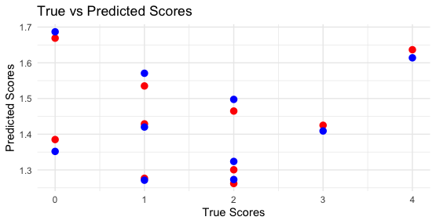

# Bayesian Analysis of Indian Super League Football Matches

## Project Overview

This project presents a hierarchical Bayesian analysis of football match outcomes in the Indian Super League (ISL) 2021-22 season. It develops and compares two distinct models: a **Double Poisson Model** and a **Bivariate Poisson Model**, to predict the number of goals scored by home and away teams. The primary goal is to determine which modeling approach offers a more nuanced and accurate representation of team performance by analyzing posterior statistics and predictive distributions.

This repository contains all the code and data necessary to replicate the analysis described in the project report.

## Table of Contents

- [Inspiration](#inspiration)
- [Features](#features)
- [Technologies Used](#technologies-used)
- [Directory Structure](#directory-structure)
- [Installation and Setup](#installation-and-setup)
- [How to Run](#how-to-run)
- [Model Highlights](#model-highlights)
- [Results and Key Findings](#results-and-key-findings)
- [Future Enhancements](#future-enhancements)
- [Contact](#contact)

## Inspiration

The growing field of sports analytics presents exciting opportunities for applying sophisticated statistical methods. This project was inspired by the desire to move beyond standard regression techniques and explore hierarchical Bayesian modeling to capture the complex dynamics of football matches. The Indian Super League provides a compelling case study for modeling team-specific strengths and understanding the correlation between home and away team performances.

## Features

-   **Hierarchical Bayesian Modeling:** Constructs a sophisticated hierarchical model to capture team-specific attacking and defensive strengths.
-   **Model Comparison:** Implements and critically compares two competing models: the Double Poisson (independent goals) and the Bivariate Poisson (correlated goals).
-   **Bayesian Inference:** Utilizes **RStan** for efficient Markov Chain Monte Carlo (MCMC) sampling to derive posterior distributions of model parameters.
-   **In-depth Diagnostics:** Conducts thorough model convergence checks using traceplots and the Gelman-Rubin statistic ($\hat{R}$).
-   **Rich Visualization:** Generates insightful plots of posterior distributions and team capabilities to interpret model results effectively.

## Technologies Used

-   **R:** For statistical computing, analysis, and visualization.
-   **RStan:** For fitting Bayesian models using the Stan programming language.
-   **Core R Packages:**
    -   `dplyr` & `readr`: For data manipulation and ingestion.
    -   `ggplot2` & `ggrepel`: For creating high-quality, non-overlapping plots.
    -   `patchwork`: For combining multiple plots into a single figure.

## Directory Structure

```
bivariate_poisson_ISL/
├── data/
│   └── ISL_2021_22.csv         # Raw dataset for the 2021-22 ISL season
├── plots/                      # Directory for saving generated plots
├── scripts/
│   ├── Project.R               # Main R script to run the full analysis
│   ├── hier_model.stan         # Stan code for the Bivariate Poisson model
│   └── non_hier_model.stan     # Stan code for the Double Poisson model
└── README.md                   # Project overview and documentation
```

## Installation and Setup

To get this project running on your local machine, follow these steps:

1.  **Clone the repository:**
    ```bash
    git clone [https://github.com/souvik-bag/bivariate_poisson_ISL.git](https://github.com/souvik-bag/bivariate_poisson_ISL.git)
    cd bivariate_poisson_ISL
    ```

2.  **Install R and RStudio:**
    -   If you don't have them installed, download R from [CRAN](https://cran.r-project.org/) and RStudio from [Posit](https://posit.co/download/rstudio-desktop/).

3.  **Install R Packages:**
    -   Open `analysis.R` in RStudio. The script checks for required packages and installs them if missing. Alternatively, you can run this command in the R console:
        ```R
        install.packages(c("rstan", "dplyr", "ggplot2", "readr", "knitr", "patchwork", "ggrepel"))
        ```

4.  **Configure RStan:**
    -   **RStan** requires a C++ toolchain. If this is your first time using Stan, you may need to configure it. Please follow the official instructions for your operating system: [RStan Getting Started](https://github.com/stan-dev/rstan/wiki/RStan-Getting-Started).

## How to Run

1.  Set your working directory in R/RStudio to the root of the cloned repository.
2.  Open the `Project.R` script.
3.  Run the script from top to bottom.

The script will automatically:
-   Load and preprocess the `ISL_2021_22.csv` data.
-   Compile and run both the Double Poisson and Bivariate Poisson Stan models.
-   Print model diagnostic summaries to the console.
-   Generate and save the Attack vs. Defense capability plots in the `/plots` directory.

## Model Highlights

### Double Poisson Model

Models the goals scored by home (`y₁`) and away (`y₂`) teams as independent Poisson processes:

```
y_g1 ~ Poisson(θ_g1)
y_g2 ~ Poisson(θ_g2)
```

### Bivariate Poisson Model

Models the goals jointly, introducing a covariance parameter (`θ_g3`) to capture the dependency between the two goal counts:

```
(y_g1, y_g2) ~ BivariatePoisson(θ_g1, θ_g2, θ_g3)
```

The scoring intensities (`θ`) are modeled hierarchically, incorporating:
- Home advantage
- Team-specific attack and defense parameters

## Results and Key Findings

-   Both models successfully captured the relative offensive and defensive strengths of the ISL teams, with the final rankings in our plots closely mirroring the actual 2021-22 league table.
-   A comparative analysis revealed that the **Bivariate Poisson model** provided a more nuanced representation of team defensive capabilities.
-   The project demonstrates a strong command of hierarchical Bayesian modeling, MCMC diagnostics, and model comparison in a real-world sports analytics application.



## Future Enhancements

-   **Data Expansion:** Apply the models to a larger dataset from a different league to further validate the findings.
-   **Dynamic Modeling:** Develop a dynamic model that updates team strength parameters after each game week.
-   **Advanced Priors:** Experiment with more complex or weakly informative priors to analyze model sensitivity.

## Contact

For any inquiries or collaboration opportunities, please feel free to reach out:

-   **Name:** Souvik Bag
-   **Email:** `sbk29@umsystem.edu`
-   **LinkedIn:** [https://www.linkedin.com/in/souvikbag/]
-   **GitHub:** [https://github.com/souvik-bag](https://github.com/souvik-bag)

