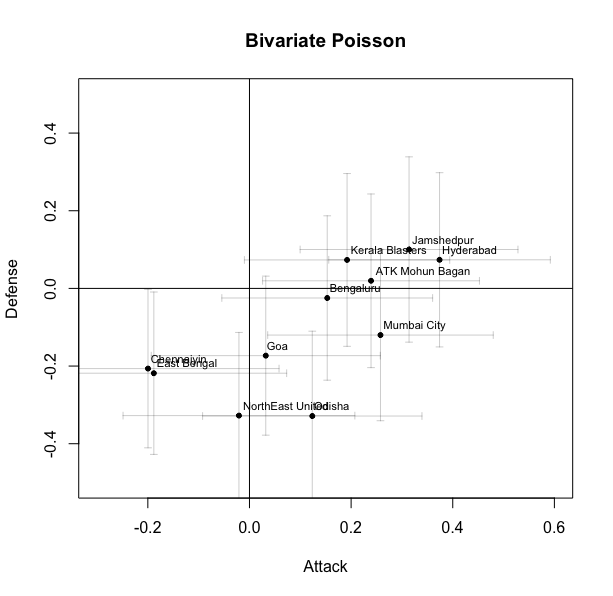

# Analysis of Indian Super League Data Using Bivariate Poisson Model and Double Poisson Model

This project explores goal-scoring patterns in the Indian Super League using hierarchical Bayesian models. Both independent Poisson models and a bivariate Poisson model were implemented to account for potential correlations between home and away goals. The dataset used is from the 2021-22 season. The analysis covers model specification, convergence diagnostics, and a comparison of posterior results.

